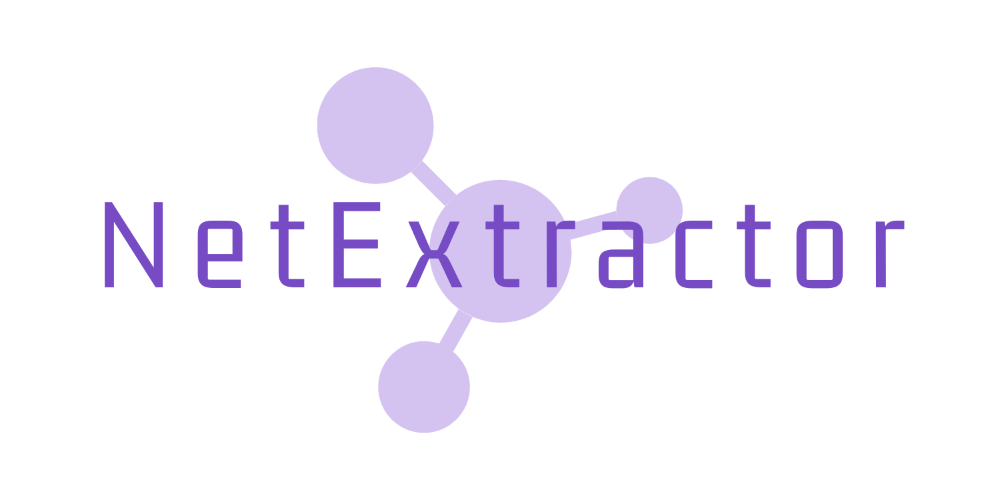

# Bienvenido a NetExtractor

NetExtractor es un proyecto realizado por la Universidad de Burgos que consiste en una aplicación empleada para generar de forma automática la red de interacciones de personajes en guiones de películas y novelas con el fin de analizar las redes obtenidas para capturar sus métricas más relevantes.

Las redes van a ser obtenidas mediante la introducción de dichos guiones en la aplicación desde la página web de https://www.imsdb.com/ o mediante la introducción de un fichero tipo ePub.

Una vez que se hayan introducido los requisitos anteriormente mencionados, podremos crear los diccionarios de personajes los cuales podemos modificar, borrar personajes, cambiarlos o combinarlos en caso de que así se requiera. Cuando se genere la red, tendremos un menú de selección de las características deseadas para extraer de la red que, una vez seleccionadas, podrán ser visualizadas en el informe generado.

De forma general esto sería lo que hace la aplicación, aun así, en este repositorio tenemos toda la información acerca del proyecto, en la carpeta "doc" tendremos toda la documentación necesaria así como los manuales de uso de la aplicación. Además la aplicación posee una wiki en la cual podremos consultar también documentación. Link de la wiki: https://wikinetextractor.wikidot.com.

## Instalación en local:

Para la instalación de todos los componentes necesarios para el despliegue de la aplicación en local, sólo debemos de instalar los componentes necesarios que usaremos que serán los siguientes:

* **Python:** *versión 3.6*
* **Flask:** *versión 1.0*
* **Flask_Babel:** *versión 0.12*
* **numpy:** *versión 1.15*
* **matplotlib:** *3.0*
* **ply:** *versión 3.11*
* **beautifulsoup4:** *versión 4.7*
* **lxml:** *versión 4.3*
* **html5lib:** *versión 1.0*
* **networkx:** *versión 2.2*
* **scipy:** *versión 1.1*

Estos requisitos son de fácil instalación mediante la ejecución del siguiente comando: 

    $ pip install -r requirements.txt

Después simplemente nos moveremos a la carpeta donde tengamos el proyecto y ejecutaremos lo siguiente:

    $ python main.py

Ahora ya tendremos corriendo nuestra aplicación, que se comprueba si en nuestra consola de comandos aparece lo siguiente:

Finalmente simplemente debemos ir al navegador web que más nos guste e introducir la dirección que aparece en la imagen, es decir https://127.0.0.1:5000 y ya tendríamos nuestra aplicación funcionando en modo local.
## Aplicación desplegada:

La aplicación está abierta y desplegada en https://www.heroku.com un sitio web para poder desplegar aplicaciones web de forma gratuita.
Para poder acceder a la aplicación se debe acceder al siguiente link: https://netextractor.herokuapp.com.

## Uso de la aplicación:

Para explicar el uso de la aplicación se han creado dos vídeos, uno con una ejecución sencilla de la película del Joker, para ver de forma general lo que hace la aplicación; y otro que explica de forma detallada cada una de las opciones que se pueden tener dentro de la aplicación, con el fin, de que el usuario pueda entender de manera más precisa el funcionamiento de NetExtractor.

- Video de la ejecución rápida: https://www.youtube.com/watch?v=-4pfwa-tp_s&feature=youtu.be
- Video de una ejecución detallada: https://www.youtube.com/watch?v=WL-U85159nM&feature=youtu.be

------------------------------------------------------------------------------------------------------------------------------------

# Welcome to NetExtractor

NetExtractor is a University of Burgos's project that consist of an application used to generate automatic character interaction networks of movie scripts and novels with the goal of analyze the obtained networks to capture each of its most relevant metrics.

Networks will be obtained through the introduction of the movie scripts from the following website  https://www.imsdb.com/ or through an ePub file.

Once the requirements have been introduced, we can create the character dictionaries which can be modify, delete characters, change them or combine them if required. When the network is generated, we will have a menu to select the desired characteristics to extract from the network that, once selected, can be displayed in the generated report.

In general, this would be what the application does, even so, in this repository we have all the information about the project, in the "doc" folder we will have all the necessary documentation as well as the application usage manuals. In addition the application has a wiki in which we can also consult documentation. Wiki link: https://wikinetextractor.wikidot.com.

## Local instalation:

For the installation of all the necessary components for the deployment of the application locally, we only have to install the necessary components that we will use which will be the following:

* **Python:** *version 3.6*
* **Flask:** *version 1.0*
* **Flask_Babel:** *version 0.12*
* **numpy:** *version 1.15*
* **matplotlib:** *3.0*
* **ply:** *version 3.11*
* **beautifulsoup4:** *version 4.7*
* **lxml:** *version 4.3*
* **html5lib:** *version 1.0*
* **networkx:** *version 2.2*
* **scipy:** *version 1.1*

These requirements are easy to install by executing the following command:

    $ pip install -r requirements.txt
    
Then we will simply move to the folder where we have the project and execute the following:

    $ python main.py

Now we will have our application running, which checks if the following appears in our command console:

Finally we simply have to go to the web browser that we like the most and enter the address that appears in the image, that is https://127.0.0.1:5000 and we would already have our application running locally.

## Deployed application:

The application is open and deployed in https://www.heroku.com a website to be able to deploy web applications for free.
To access the application you must access the following link: https://netextractor.herokuapp.com.
